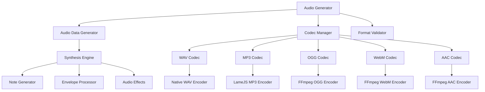
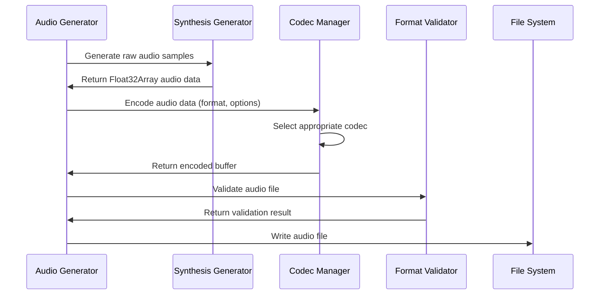

# Audio Codec Repair Design

## Overview

The FakeGen CLI tool currently has broken audio generation functionality. The existing implementation attempts to create audio files by manually constructing format headers (MP3, OGG, WebM, AAC) without proper codec encoding, resulting in corrupted and unplayable audio files. This design outlines the architecture and implementation strategy to fix the audio generation system using proper codec libraries and techniques.

## Problem Analysis

### Current Issues

1. **Invalid MP3 Generation**: Current implementation creates fake MP3 files by concatenating ID3v2 headers with raw WAV data, which produces invalid MP3 files
2. **Broken Container Formats**: OGG, WebM, and AAC implementations only create container headers without proper codec payload
3. **Missing Proper Encoding**: No actual audio compression or proper codec implementation
4. **Unused Dependencies**: Available audio libraries (`lamejs`, `node-lame`, `audiobuffer-to-wav`, `wav-encoder`) are not being utilized
5. **No FFmpeg Integration**: FFmpeg dependency exists but not used for audio generation

### Root Causes

- Manual binary format construction without understanding codec specifications
- Lack of proper audio encoding pipeline
- No validation of generated audio files
- Missing abstraction layer for different audio codecs

## Architecture Design

### Component Structure



### Audio Processing Pipeline



## Implementation Strategy

### Phase 1: Core Audio Data Generation Enhancement

#### Improved Audio Synthesis

- **Waveform Generation**: Enhanced synthesis with multiple oscillators (sine, square, triangle, sawtooth)
- **ADSR Envelope**: Proper Attack, Decay, Sustain, Release envelope processing
- **Audio Effects**: Reverb, chorus, and filtering capabilities
- **Sample Rate Handling**: Support for multiple sample rates (22050, 44100, 48000, 96000 Hz)

#### Audio Data Structure

```javascript
class AudioBuffer {
  constructor(sampleRate, channels, duration) {
    this.sampleRate = sampleRate;
    this.channels = channels;
    this.duration = duration;
    this.samples = new Float32Array(sampleRate * channels * duration);
  }
}
```

### Phase 2: Codec Implementation Strategy

#### WAV Codec (Native Implementation)

- Utilize `wav-encoder` library for proper WAV file generation
- Support for multiple bit depths (16-bit, 24-bit, 32-bit)
- Proper RIFF/WAVE header construction with accurate chunk sizes

#### MP3 Codec (LameJS Integration)

- Replace fake MP3 generation with `lamejs` library
- Implement proper LAME encoder configuration
- Support for variable bitrates (128, 192, 256, 320 kbps)
- Proper ID3v2 metadata embedding

#### OGG Vorbis Codec (FFmpeg Integration)

- Utilize FFmpeg for proper OGG Vorbis encoding
- Implement quality-based encoding (q0-q10)
- Proper OGG container with Vorbis codec payload

#### WebM Audio Codec (FFmpeg Integration)

- Use FFmpeg for WebM container with Opus codec
- Support for variable bitrate encoding
- Proper EBML structure with audio track definition

#### AAC Codec (FFmpeg Integration)

- Implement AAC-LC encoding via FFmpeg
- Support for ADTS and MP4 containers
- Variable bitrate and quality settings

### Phase 3: Codec Manager Design

#### Codec Interface

```javascript
class AudioCodec {
  constructor(config) {
    this.config = config;
  }

  async encode(audioBuffer, options) {
    throw new Error("encode method must be implemented");
  }

  validate(buffer) {
    throw new Error("validate method must be implemented");
  }

  getFileExtension() {
    throw new Error("getFileExtension method must be implemented");
  }
}
```

#### Codec Factory Pattern

```javascript
class CodecFactory {
  static createCodec(format, config) {
    switch (format) {
      case "wav":
        return new WavCodec(config);
      case "mp3":
        return new Mp3Codec(config);
      case "ogg":
        return new OggCodec(config);
      case "webm":
        return new WebmCodec(config);
      case "aac":
        return new AacCodec(config);
      default:
        throw new Error(`Unsupported format: ${format}`);
    }
  }
}
```

### Phase 4: Enhanced Audio Generation Features

#### Multi-Track Audio Generation

- Support for layered audio synthesis
- Stereo panning and spatial audio effects
- Dynamic range compression

#### Audio Quality Profiles

- **Low Quality**: 22050 Hz, 128 kbps (for testing)
- **Standard Quality**: 44100 Hz, 192 kbps (default)
- **High Quality**: 48000 Hz, 320 kbps (for production)

#### Procedural Music Generation

- Chord progression algorithms
- Rhythm pattern generation
- Scale-based melody generation
- Harmonic progression rules

## Data Flow Architecture

### Input Configuration

```yaml
audio:
  enabled: true
  count: 5
  duration: 10
  sampleRate: 44100
  formats: ["wav", "mp3", "ogg", "webm", "aac"]
  quality:
    profile: "standard" # low, standard, high
    bitrate: 192 # for lossy formats
    vbr: true # variable bitrate
  synthesis:
    type: "procedural" # procedural, noise, tones
    complexity: "medium" # simple, medium, complex
    effects: ["reverb", "chorus"]
```

### Output Structure

```
audio/
├── wav/
│   ├── synthesized_1.wav
│   └── synthesized_2.wav
├── mp3/
│   ├── synthesized_1.mp3
│   └── synthesized_2.mp3
├── ogg/
│   ├── synthesized_1.ogg
│   └── synthesized_2.ogg
├── webm/
│   ├── synthesized_1.webm
│   └── synthesized_2.webm
└── aac/
    ├── synthesized_1.aac
    └── synthesized_2.aac
```

## Technical Implementation

### Dependency Management

```javascript
// Optional dependency loading with fallbacks
class DependencyManager {
  static loadAudioDependencies() {
    const dependencies = {};

    try {
      dependencies.lamejs = require("lamejs");
    } catch (e) {
      console.warn("LameJS not available, MP3 encoding disabled");
    }

    try {
      dependencies.wavEncoder = require("wav-encoder");
    } catch (e) {
      console.warn("WAV encoder not available, using fallback");
    }

    try {
      dependencies.ffmpeg = require("fluent-ffmpeg");
      dependencies.ffmpegPath = require("@ffmpeg-installer/ffmpeg").path;
      dependencies.ffmpeg.setFfmpegPath(dependencies.ffmpegPath);
    } catch (e) {
      console.warn("FFmpeg not available, some formats disabled");
    }

    return dependencies;
  }
}
```

### Error Handling Strategy

- **Graceful Degradation**: Fall back to WAV format if codec unavailable
- **Validation Pipeline**: Verify generated files before saving
- **Detailed Logging**: Comprehensive error reporting with codec-specific messages
- **Format Fallbacks**: Automatic format substitution for failed encodings

### Memory Management

- **Stream Processing**: Process large audio files in chunks
- **Buffer Pooling**: Reuse audio buffers to reduce GC pressure
- **Cleanup Procedures**: Proper cleanup of temporary files and resources

## Testing Strategy

### Unit Testing

- **Codec Validation**: Test each codec implementation independently
- **Audio Quality**: Verify bit depth, sample rate, and channel configuration
- **Format Compliance**: Validate generated files against format specifications
- **Error Scenarios**: Test graceful handling of missing dependencies

### Integration Testing

- **End-to-End Generation**: Complete audio generation pipeline testing
- **Multi-Format Support**: Verify all supported formats generate correctly
- **Configuration Validation**: Test various quality and synthesis settings
- **File System Integration**: Verify proper file creation and organization

### Performance Testing

- **Memory Usage**: Monitor memory consumption during generation
- **Generation Speed**: Benchmark audio generation performance
- **Concurrent Generation**: Test multiple format generation simultaneously
- **Large File Handling**: Test with extended duration audio files

## Migration Strategy

### Implementation Phases

1. **Phase 1**: Replace broken codec implementations with working versions
2. **Phase 2**: Enhance audio synthesis quality and features
3. **Phase 3**: Add advanced codec options and quality profiles
4. **Phase 4**: Implement procedural music generation features

### Backward Compatibility

- Maintain existing configuration file format
- Preserve output directory structure
- Keep existing CLI command interface
- Provide deprecation warnings for removed features

### Rollback Plan

- Feature flags for new codec implementations
- Fallback to basic WAV generation if issues occur
- Comprehensive logging for debugging codec issues
- Version-specific configuration options
