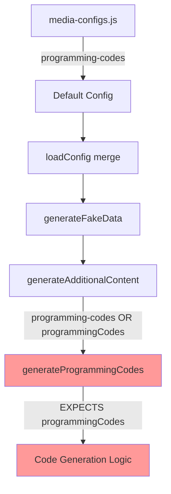
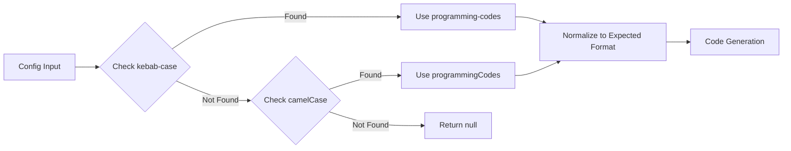
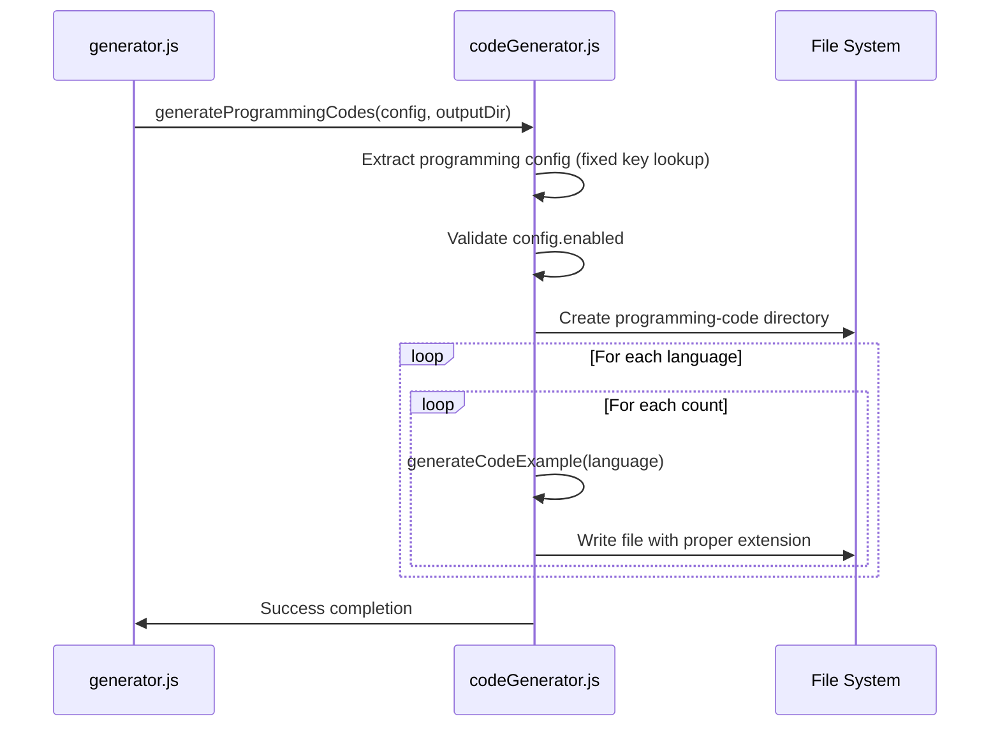
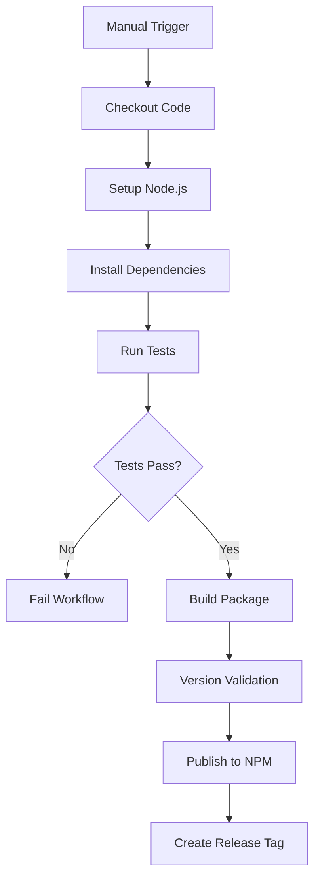
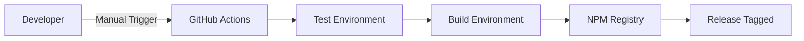

# Code Generator Investigation and Fix Design

## Overview

This design addresses two critical issues in the FakeGen CLI tool:

1. **Code Generator Not Working**: Investigation reveals configuration key mismatch between the generator and code generator modules
2. **GitHub Actions Implementation**: Manual package release workflow with proper testing and build validation

## Problem Analysis

### Code Generator Issue Investigation

**Root Cause Identified**: Configuration key mismatch in the code generation workflow.

#### Configuration Flow Problems

1. **Configuration Definition**:

   - Media configs define programming codes as `'programming-codes'` (kebab-case)
   - Located in `src/config/media-configs.js` in `PROGRAMMING_CONFIG`

2. **Generator Integration**:

   - Main generator looks for both `config['programming-codes']` OR `config.programmingCodes` (line 223)
   - Uses fallback: `const programmingConfig = config['programming-codes'] || config.programmingCodes;`

3. **Code Generator Function**:
   - Expects `config.programmingCodes` (camelCase) - line 147 in codeGenerator.js
   - Function signature: `if (!config.programmingCodes || !config.programmingCodes.enabled)`
   - This creates a **CRITICAL MISMATCH**

#### Configuration Data Flow Diagram



### GitHub Actions Requirements

Implementation of manual release workflow supporting:

- Manual trigger capability
- Test execution before release
- Package build validation
- NPM publishing with proper versioning

## Architecture

### Code Generator Fix Architecture

#### Configuration Resolution Strategy



#### Fixed Code Generator Flow



### GitHub Actions Architecture

#### Workflow Structure



#### Deployment Pipeline



## Implementation Details

### Code Generator Fixes

#### Configuration Key Resolution

**Problem**: Function expects `config.programmingCodes` but receives `config['programming-codes']`

**Solution**: Implement configuration normalization in `generateProgrammingCodes` function

```javascript
// Fixed configuration extraction logic
async function generateProgrammingCodes(config, outputDir) {
  // Support both kebab-case and camelCase configuration keys
  const programmingConfig =
    config["programming-codes"] || config.programmingCodes;

  if (!programmingConfig || !programmingConfig.enabled) {
    console.log("Programming codes generation is disabled");
    return;
  }
  // ... rest of function
}
```

#### Enhanced Error Handling

```javascript
// Add validation and error reporting
if (
  !programmingConfig.languages ||
  !Array.isArray(programmingConfig.languages)
) {
  console.warn("No programming languages configured, skipping code generation");
  return;
}

if (programmingConfig.languages.length === 0) {
  console.warn("Empty programming languages array, skipping code generation");
  return;
}
```

#### Configuration Validation

```javascript
function validateProgrammingConfig(config) {
  const required = ["enabled", "languages", "count"];
  const missing = required.filter((key) => !(key in config));

  if (missing.length > 0) {
    throw new Error(
      `Programming config missing required fields: ${missing.join(", ")}`
    );
  }

  if (!Array.isArray(config.languages)) {
    throw new Error("Programming config languages must be an array");
  }

  if (typeof config.count !== "number" || config.count < 1) {
    throw new Error("Programming config count must be a positive number");
  }
}
```

### GitHub Actions Implementation

#### Workflow File Structure

**File**: `.github/workflows/release.yml`

**Trigger Configuration**:

```yaml
on:
  workflow_dispatch:
    inputs:
      version:
        description: "Release version (e.g., 1.2.0)"
        required: true
        type: string
      publish:
        description: "Publish to NPM"
        required: true
        type: boolean
        default: true
```

#### Job Configuration

**Environment Setup**:

```yaml
jobs:
  release:
    runs-on: ubuntu-latest
    steps:
      - uses: actions/checkout@v4
      - uses: actions/setup-node@v4
        with:
          node-version: "18"
          registry-url: "https://registry.npmjs.org"
```

**Testing Strategy**:

```yaml
- name: Install dependencies
  run: npm ci

- name: Run code generator test
  run: |
    npm run start
    ls -la fakegen/
    test -d fakegen/programming-code
    test -f fakegen/programming-code/hello_1.js
```

**Package Management**:

```yaml
- name: Update package version
  run: npm version ${{ github.event.inputs.version }} --no-git-tag-version

- name: Publish to NPM
  if: ${{ github.event.inputs.publish == 'true' }}
  run: npm publish
  env:
    NODE_AUTH_TOKEN: ${{ secrets.NPM_TOKEN }}
```

#### Release Automation

**Version Management**:

```yaml
- name: Create Git tag
  if: ${{ github.event.inputs.publish == 'true' }}
  run: |
    git config user.name github-actions
    git config user.email github-actions@github.com
    git tag v${{ github.event.inputs.version }}
    git push origin v${{ github.event.inputs.version }}
```

**Artifact Creation**:

```yaml
- name: Create release
  if: ${{ github.event.inputs.publish == 'true' }}
  uses: actions/create-release@v1
  env:
    GITHUB_TOKEN: ${{ secrets.GITHUB_TOKEN }}
  with:
    tag_name: v${{ github.event.inputs.version }}
    release_name: Release v${{ github.event.inputs.version }}
    draft: false
    prerelease: false
```

## Testing Strategy

### Code Generator Testing

#### Unit Tests for Configuration Resolution

```javascript
describe("generateProgrammingCodes", () => {
  it("should work with kebab-case configuration", async () => {
    const config = {
      "programming-codes": {
        enabled: true,
        languages: ["js", "py"],
        count: 2,
      },
    };

    await generateProgrammingCodes(config, "./test-output");
    // Verify files exist
  });

  it("should work with camelCase configuration", async () => {
    const config = {
      programmingCodes: {
        enabled: true,
        languages: ["js", "py"],
        count: 2,
      },
    };

    await generateProgrammingCodes(config, "./test-output");
    // Verify files exist
  });
});
```

#### Integration Testing

```javascript
describe("Full Generation Flow", () => {
  it("should generate all configured code types", async () => {
    const config = await loadConfig();
    await generateFakeData(config);

    // Verify programming-code directory exists
    expect(fs.existsSync("./fakegen/programming-code")).toBe(true);

    // Verify files for each configured language
    const languages = config["programming-codes"].languages;
    languages.forEach((lang) => {
      const extension = getFileExtension(lang);
      expect(
        fs.existsSync(`./fakegen/programming-code/hello_1.${extension}`)
      ).toBe(true);
    });
  });
});
```

### GitHub Actions Testing

#### Local Testing with Act

```bash
# Install act for local testing
brew install act

# Test workflow locally
act workflow_dispatch -e test-event.json
```

#### Validation Checks

```yaml
- name: Validate generated files
  run: |
    # Check programming code generation
    test -d fakegen/programming-code || exit 1
    test -f fakegen/programming-code/hello_1.js || exit 1
    test -f fakegen/programming-code/hello_1.py || exit 1

    # Check file content is not empty
    test -s fakegen/programming-code/hello_1.js || exit 1

    # Verify proper extensions
    ls fakegen/programming-code/ | grep -E '\.(js|py|java|go|rs)$' || exit 1
```

## Validation and Quality Assurance

### Pre-Deployment Validation

#### Code Generator Validation

```javascript
// Validation checklist for code generator fix
const validationChecklist = {
  configurationResolution: [
    "Supports kebab-case programming-codes key",
    "Supports camelCase programmingCodes key",
    "Graceful fallback when neither exists",
    "Proper error messages for invalid config",
  ],

  fileGeneration: [
    "Creates programming-code directory",
    "Generates files for all configured languages",
    "Uses correct file extensions",
    "Content is syntactically valid for each language",
    "Proper file naming convention (hello_N.ext)",
  ],

  errorHandling: [
    "Handles missing configuration gracefully",
    "Validates language array exists",
    "Validates count is positive number",
    "Provides meaningful error messages",
  ],
};
```

#### GitHub Actions Validation

```yaml
# Validation matrix for different scenarios
strategy:
  matrix:
    test-scenario:
      - basic-generation
      - programming-codes-only
      - all-features-enabled
    node-version: [16, 18, 20]
```

### Post-Deployment Monitoring

#### Success Metrics

```javascript
const successMetrics = {
  codeGeneration: {
    filesCreated: "Count of programming code files generated",
    languagesCovered: "Number of programming languages processed",
    executionTime: "Time taken for code generation phase",
    errorRate: "Percentage of failed language generations",
  },

  cicdPipeline: {
    buildSuccess: "Percentage of successful workflow runs",
    testCoverage: "Code coverage from automated tests",
    deploymentTime: "Time from trigger to NPM publication",
    releaseIntegrity: "Validation of published package contents",
  },
};
```

## Implementation Plan

### Phase 1: Code Generator Fix

1. **Configuration Resolution** (1 day)

   - Modify `generateProgrammingCodes` function to support both key formats
   - Add configuration validation
   - Implement error handling

2. **Testing and Validation** (1 day)
   - Create unit tests for configuration scenarios
   - Test with actual configuration files
   - Validate file generation output

### Phase 2: GitHub Actions Implementation

1. **Workflow Creation** (1 day)

   - Create `.github/workflows/release.yml`
   - Configure manual triggers and inputs
   - Set up Node.js environment

2. **Release Automation** (1 day)

   - Implement version management
   - Configure NPM publishing
   - Set up Git tagging and release creation

3. **Testing and Security** (1 day)
   - Test workflow with act locally
   - Configure required secrets (NPM_TOKEN)
   - Validate security permissions

### Phase 3: Integration and Documentation

1. **End-to-End Testing** (1 day)

   - Test complete code generation flow
   - Validate GitHub Actions workflow
   - Performance testing

2. **Documentation Updates** (1 day)
   - Update README with GitHub Actions information
   - Document manual release process
   - Create troubleshooting guide
