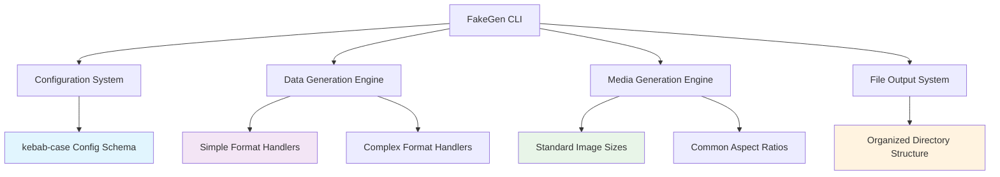
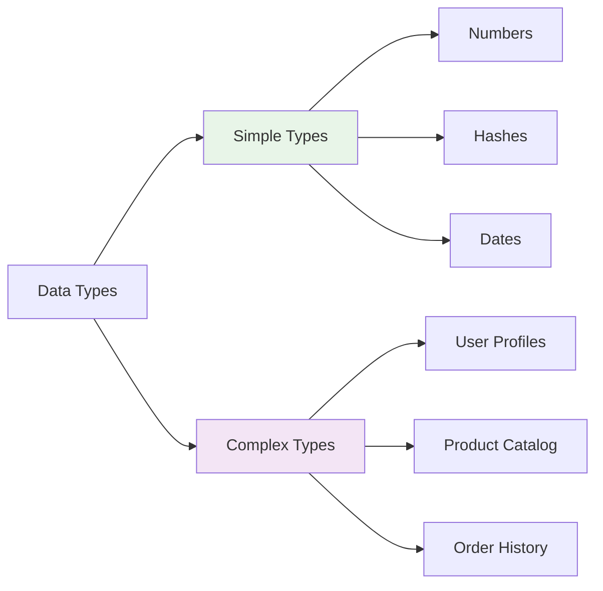
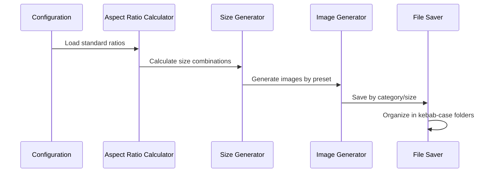

# FakeGen Complete Refactor Design

## Overview

This document outlines a comprehensive refactoring of the FakeGen CLI tool to address naming conventions, folder organization, aspect ratio standardization, data formatting improvements, and documentation accuracy. The refactor focuses on creating a more professional, standardized, and user-friendly data generation tool.

## Architecture

### Current Issues Identified

1. **Naming Convention Inconsistency**: Mixed camelCase and inconsistent naming throughout the codebase
2. **Poor Folder Organization**: Scattered file structure without logical grouping
3. **Non-Standard Aspect Ratios**: Custom aspect ratios that don't match industry standards
4. **Verbose Simple Data Formatting**: Simple number files contain unnecessary metadata formatting
5. **Documentation Inaccuracies**: README contains outdated or false claims about features
6. **Missing Common Image Sizes**: Industry-standard sizes not represented



## Component Architecture

### 1. Configuration Management System

**New Directory Structure:**

```
src/
├── config/
│   ├── data-types.js          # kebab-case data type definitions
│   ├── media-configs.js       # media generation configurations
│   ├── aspect-ratios.js       # standard aspect ratio definitions
│   ├── image-sizes.js         # common image size presets
│   └── index.js              # main configuration loader
```

**Standard Aspect Ratios:**

- `1:1` (Square)
- `4:3` (Traditional)
- `3:2` (Classic Photo)
- `16:10` (Widescreen)
- `16:9` (Modern Widescreen)
- `21:9` (Ultra-wide)
- `9:16` (Mobile Portrait)

**Common Image Sizes:**

- Thumbnail: 150x150, 200x200
- Small: 320x240, 480x320
- Medium: 640x480, 800x600
- Large: 1024x768, 1280x720
- HD: 1920x1080, 2560x1440
- 4K: 3840x2160

### 2. Data Generation Engine

**Refactored Generator Structure:**

```
src/
├── generators/
│   ├── data/
│   │   ├── simple-types.js    # numbers, strings, primitives
│   │   ├── complex-types.js   # nested objects, arrays
│   │   └── crypto-types.js    # hashes, UUIDs
│   ├── media/
│   │   ├── image-generator.js
│   │   ├── favicon-generator.js
│   │   └── code-generator.js
│   └── index.js
```

**Simple Data Format Changes:**

_Current numbers.txt format:_

```
Record 1:
  --------------------
  number: 11

Record 2:
  --------------------
  number: 12
```

_New numbers.txt format:_

```
11
12
13
14
15
```

### 3. Output Directory Organization

**New kebab-case Directory Structure:**

```
fake-data/
├── data/
│   ├── user-profiles/
│   │   ├── json/user-profiles.json
│   │   ├── csv/user-profiles.csv
│   │   ├── txt/user-profiles.txt
│   │   ├── yml/user-profiles.yml
│   │   ├── toml/user-profiles.toml
│   │   └── xml/user-profiles.xml
│   ├── product-catalog/
│   ├── order-history/
│   ├── blog-posts/
│   ├── simple-numbers/
│   ├── crypto-hashes/
│   └── date-sequences/
├── images/
│   ├── square/         # 1:1 aspect ratio
│   │   ├── thumbnails/ # 150x150, 200x200
│   │   ├── medium/     # 512x512, 800x800
│   │   └── large/      # 1024x1024, 2048x2048
│   ├── traditional/    # 4:3 aspect ratio
│   │   ├── small/      # 320x240, 640x480
│   │   ├── medium/     # 800x600, 1024x768
│   │   └── large/      # 1600x1200, 2048x1536
│   ├── widescreen/     # 16:9 aspect ratio
│   │   ├── hd/         # 1280x720, 1920x1080
│   │   ├── 4k/         # 3840x2160
│   │   └── mobile/     # 854x480
│   └── ultra-wide/     # 21:9 aspect ratio
├── favicons/
│   ├── standard-sizes/ # 16x16, 32x32, 48x48
│   ├── high-res/       # 128x128, 256x256, 512x512
│   └── apple-touch/    # 180x180, 192x192
├── programming-examples/
│   ├── web-languages/  # js, ts, html, css
│   ├── backend/        # py, java, go, php
│   ├── mobile/         # swift, kt, dart
│   └── systems/        # c, cpp, rs, go
└── media/              # optional
    ├── videos/
    └── audio/
```

## Data Models & Schema

### Configuration Schema (kebab-case)

```yaml
output:
  directory: "./fake-data"
  formats:
    - json
    - csv
    - txt
    - yml
    - toml
    - xml

data:
  count: 10
  types:
    user-profiles:
      enabled: true
      fields:
        - name: user-id
          type: number-ascending
        - name: first-name
          type: first-name
        - name: last-name
          type: last-name
        - name: email-address
          type: email
    product-catalog:
      enabled: true
      fields:
        - name: product-id
          type: number-ascending
        - name: product-name
          type: product-name
        - name: unit-price
          type: price
    simple-numbers:
      enabled: true
      fields:
        - name: number
          type: number-ascending
    crypto-hashes:
      enabled: true
      fields:
        - name: sha256-hash
          type: sha256
        - name: md5-hash
          type: md5

images:
  enabled: true
  presets:
    square:
      enabled: true
      sizes:
        thumbnail: [150, 200]
        medium: [512, 800]
        large: [1024, 2048]
    traditional:
      enabled: true
      sizes:
        small: [[320, 240], [640, 480]]
        medium: [[800, 600], [1024, 768]]
        large: [[1600, 1200]]
    widescreen:
      enabled: true
      sizes:
        hd: [[1280, 720], [1920, 1080]]
        4k: [[3840, 2160]]
    ultra-wide:
      enabled: true
      sizes:
        standard: [[2560, 1080], [3440, 1440]]
  formats: ["jpg", "png", "webp"]

favicons:
  enabled: true
  preset-groups:
    standard-sizes: [16, 32, 48]
    high-res: [128, 256, 512]
    apple-touch: [180, 192]
  formats: ["png", "ico"]
```

### Data Type Standardization

**Field Naming Convention:**

- All field names use kebab-case: `user-id`, `first-name`, `email-address`
- All data type names use kebab-case: `user-profiles`, `product-catalog`, `blog-posts`
- All configuration keys use kebab-case: `output-directory`, `image-formats`

**Simple Data Types Format:**

```javascript
// For simple number sequences - only values
function formatSimpleNumbers(data) {
  return data.map((item) => item.number).join("\n");
}

// For crypto hashes - only hash values
function formatCryptoHashes(data) {
  return data.map((item) => item.hash).join("\n");
}

// For date sequences - only dates
function formatDateSequences(data) {
  return data.map((item) => item.date).join("\n");
}
```

## Business Logic Layer

### 1. Data Generation Strategy

**Type Classification:**



**Simple Types:**

- Generate minimal formatted output (numbers-only, hashes-only)
- Single line per record
- No metadata or record structure

**Complex Types:**

- Full record structure with nested objects
- Multiple output formats (JSON, CSV, XML, etc.)
- Rich metadata and relationships

### 2. Image Generation Pipeline

**Size Generation Strategy:**



**Preset-Based Generation:**

- Square images: thumbnails, avatars, icons
- Traditional (4:3): classic photography, presentations
- Widescreen (16:9): modern displays, video thumbnails
- Ultra-wide (21:9): cinematic, banner images

### 3. File Organization Strategy

**Directory Naming Rules:**

1. All directories use kebab-case
2. Logical grouping by data complexity
3. Size-based subdirectories for images
4. Format-based subdirectories for data

## Testing Strategy

### Unit Tests Structure

```
tests/
├── unit/
│   ├── config/
│   │   ├── kebab-case-validation.test.js
│   │   ├── aspect-ratio-calculation.test.js
│   │   └── size-preset-generation.test.js
│   ├── generators/
│   │   ├── simple-data-formatting.test.js
│   │   ├── complex-data-structure.test.js
│   │   └── image-size-generation.test.js
│   └── utils/
│       ├── directory-organization.test.js
│       └── file-naming-conventions.test.js
├── integration/
│   ├── end-to-end-generation.test.js
│   ├── configuration-loading.test.js
│   └── output-structure-validation.test.js
└── fixtures/
    ├── sample-configs/
    └── expected-outputs/
```

### Test Cases

**Configuration Tests:**

- Validate kebab-case naming enforcement
- Test aspect ratio calculations
- Verify size preset generation
- Configuration schema validation

**Data Generation Tests:**

- Simple number formatting (numbers only)
- Complex data structure integrity
- Cross-format consistency
- Field name kebab-case conversion

**File Organization Tests:**

- Directory structure creation
- File naming conventions
- Path resolution accuracy
- Output organization validation

## Implementation Phases

### Phase 1: Configuration Refactor

1. **Update configuration schema to enforce kebab-case**
2. **Implement standard aspect ratio definitions**
3. **Create image size preset system**
4. **Refactor data type definitions**

### Phase 2: Data Generation Refactor

1. **Implement simple data formatters**
2. **Update field naming to kebab-case**
3. **Refactor complex data generators**
4. **Add data type classification system**

### Phase 3: File Organization Refactor

1. **Implement new directory structure**
2. **Update file naming conventions**
3. **Create organized output system**
4. **Add path resolution utilities**

### Phase 4: Image Generation Refactor

1. **Implement preset-based size generation**
2. **Add standard aspect ratio support**
3. **Create organized image directories**
4. **Update favicon generation system**

### Phase 5: Documentation Update

1. **Audit README for false claims**
2. **Update feature descriptions**
3. **Add new configuration examples**
4. **Update CLI help documentation**

## Migration Strategy

### Backward Compatibility

- Support both old and new configuration formats during transition
- Provide migration utility to convert existing configs
- Maintain API compatibility for existing integrations
- Add deprecation warnings for old formats

### Configuration Migration

```yaml
# Legacy format support with warnings
data:
  types:
    users: # Auto-convert to user-profiles
      fields:
        - name: firstName # Auto-convert to first-name
          type: firstName # Auto-convert to first-name

# New format
data:
  types:
    user-profiles:
      fields:
        - name: first-name
          type: first-name
```

### File Structure Migration

- Provide migration script to reorganize existing output
- Support both old and new directory structures
- Add configuration option to choose output format
- Gradual deprecation of old structure

## Performance Considerations

### Optimizations

1. **Lazy Loading**: Load configuration and generators on demand
2. **Parallel Processing**: Generate images and data concurrently
3. **Memory Management**: Stream large datasets instead of loading in memory
4. **Caching**: Cache aspect ratio calculations and size presets

### Resource Management

- Limit concurrent image generation to prevent memory issues
- Implement progress tracking for large generation jobs
- Add configurable batch sizes for data generation
- Optimize file I/O with buffered writes

## Quality Assurance

### Code Quality Standards

- ESLint configuration enforcing kebab-case where applicable
- Prettier formatting for consistent code style
- JSDoc documentation for all public APIs
- Type checking with JSDoc annotations

### Validation Framework

- Configuration schema validation
- Output structure validation
- File naming convention validation
- Data format consistency checks

### Error Handling

- Comprehensive error messages with suggestions
- Graceful fallbacks for missing dependencies
- Validation errors with specific field information
- Recovery mechanisms for partial failures
