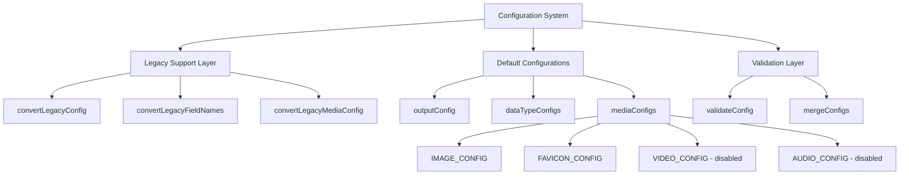
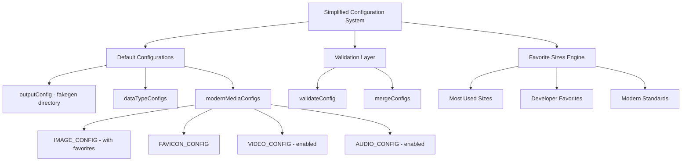

# Media Configuration Refactor Design

## Overview

This design outlines the refactoring of FakeGen's media configuration system to improve usability and modernize the codebase. The refactor removes legacy migration support, introduces favorite image sizes based on usage patterns, changes the default output directory to 'fakegen', and enables video and audio generation by default.

## Repository Type

**CLI Tool** - FakeGen is a command-line tool for generating fake data, images, and media content for development and testing purposes.

## Architecture

### Current Configuration Structure



### Refactored Configuration Architecture



## Configuration Changes

### 1. Legacy Migration Removal

#### Files to Modify

- `src/config/index.js`
- `src/config/media-configs.js`
- `src/config/data-types.js`

#### Functions to Remove

- `convertLegacyConfig()`
- `convertLegacyFieldNames()`
- `convertLegacyMediaConfig()`
- `convertConfigObject()`

#### Impact

- Eliminates complexity from configuration loading
- Reduces bundle size and maintenance overhead
- Forces users to modern kebab-case configuration format
- Removes backward compatibility with camelCase configs

### 2. Default Output Directory Change

#### Current Default

```javascript
const outputConfig = {
  directory: "./fake-data",
  formats: ["json", "csv", "txt", "yml", "toml", "xml"],
};
```

#### New Default

```javascript
const outputConfig = {
  directory: "./fakegen",
  formats: ["json", "csv", "txt", "yml", "toml", "xml"],
};
```

### 3. Favorite Image Sizes Implementation

#### Research-Based Favorite Sizes

Based on modern web development and common use cases, the following sizes are identified as most frequently used:

| Category             | Sizes                       | Usage Context                    |
| -------------------- | --------------------------- | -------------------------------- |
| **Web Essentials**   | 320×240, 640×480, 1920×1080 | Responsive images, hero sections |
| **Social Media**     | 1080×1080, 1200×630         | Instagram posts, Facebook shares |
| **Mobile First**     | 375×667, 414×896            | iPhone viewports, mobile testing |
| **Development**      | 400×300, 800×600, 1024×768  | Placeholder content, prototyping |
| **Modern Standards** | 1280×720, 2560×1440         | HD displays, high-DPI screens    |

#### Implementation

```javascript
const FAVORITE_IMAGE_SIZES = {
  "most-used": {
    description: "Most frequently used sizes in web development",
    enabled: true,
    priority: "high",
    sizes: [
      { width: 320, height: 240, name: "web-small", usage: "mobile-first" },
      { width: 640, height: 480, name: "web-medium", usage: "responsive" },
      { width: 1920, height: 1080, name: "web-large", usage: "desktop" },
      {
        width: 1080,
        height: 1080,
        name: "social-square",
        usage: "social-media",
      },
      { width: 1200, height: 630, name: "social-landscape", usage: "og-image" },
    ],
  },
  "developer-favorites": {
    description: "Commonly requested sizes for prototyping",
    enabled: true,
    priority: "medium",
    sizes: [
      { width: 400, height: 300, name: "prototype-small", usage: "wireframes" },
      { width: 800, height: 600, name: "prototype-medium", usage: "mockups" },
      {
        width: 1024,
        height: 768,
        name: "prototype-large",
        usage: "desktop-prototype",
      },
      {
        width: 375,
        height: 667,
        name: "mobile-iphone",
        usage: "mobile-testing",
      },
      { width: 414, height: 896, name: "mobile-plus", usage: "large-mobile" },
    ],
  },
};
```

### 4. Video and Audio Default Enablement

#### Current Configuration

```javascript
const VIDEO_CONFIG = {
  enabled: false, // Currently disabled
  // ... other config
};

const AUDIO_CONFIG = {
  enabled: false, // Currently disabled
  // ... other config
};
```

#### New Configuration

```javascript
const VIDEO_CONFIG = {
  enabled: true, // Enable by default
  count: 2, // Reduce count to manage file size
  duration: 5, // Slightly longer for better demos
  width: 1280,
  height: 720,
  formats: ["mp4"], // Focus on most compatible format
  fps: 30,
  "quality-profiles": {
    standard: { width: 1280, height: 720, fps: 30 },
    high: { width: 1920, height: 1080, fps: 30 },
  },
};

const AUDIO_CONFIG = {
  enabled: true, // Enable by default
  count: 3, // Reasonable count
  duration: 8, // Good length for testing
  "sample-rate": 44100,
  formats: ["mp3", "wav"], // Most common formats
  "quality-profiles": {
    standard: { "sample-rate": 44100, bitrate: 128 },
    high: { "sample-rate": 48000, bitrate: 192 },
  },
  "musical-styles": {
    electronic: { tempo: 120, waveforms: ["square", "sawtooth"] },
    ambient: { tempo: 80, waveforms: ["sine", "triangle"] },
  },
};
```

## Implementation Strategy

### Phase 1: Legacy Code Removal

1. **Remove Legacy Functions**

   - Delete `convertLegacyConfig()` from `src/config/index.js`
   - Remove legacy conversion calls from `loadConfig()`
   - Delete `convertLegacyMediaConfig()` from `src/config/media-configs.js`
   - Clean up unused imports

2. **Update Configuration Loading**

   ```javascript
   async function loadConfig() {
     const configPath = path.join(process.cwd(), ".fakegen.yml");

     try {
       if (await fs.pathExists(configPath)) {
         const configContent = await fs.readFile(configPath, "utf8");
         let userConfig = yaml.load(configContent);

         if (userConfig && typeof userConfig === "object") {
           // Direct merge without legacy conversion
           const mergedConfig = mergeConfigs(defaultConfig, userConfig);
           validateConfig(mergedConfig);
           return mergedConfig;
         }
       }
     } catch (error) {
       console.warn(`Configuration load failed: ${error.message}`);
     }

     return defaultConfig;
   }
   ```

### Phase 2: Favorite Sizes Integration

1. **Create Favorite Sizes Module**

   - New file: `src/config/favorite-sizes.js`
   - Implement research-based size collections
   - Add usage metadata for documentation

2. **Update Image Configuration**
   ```javascript
   const IMAGE_CONFIG = {
     enabled: true,
     count: 20, // Increase to accommodate favorites
     formats: ["jpg", "png", "webp"],
     "aspect-ratios": getDefaultAspectRatios(),
     "favorite-sizes": getFavoriteSizes(), // New feature
     "use-favorites-first": true, // Prioritize favorites
     "generate-sizes": true,
     // ... existing config
   };
   ```

### Phase 3: Default Changes

1. **Update Output Directory**

   ```javascript
   const outputConfig = {
     directory: "./fakegen", // Changed from './fake-data'
     formats: ["json", "csv", "txt", "yml", "toml", "xml"],
   };
   ```

2. **Enable Media Generation**

   ```javascript
   const VIDEO_CONFIG = {
     enabled: true, // Changed from false
     count: 2,
     duration: 5,
     // ... optimized settings
   };

   const AUDIO_CONFIG = {
     enabled: true, // Changed from false
     count: 3,
     duration: 8,
     // ... optimized settings
   };
   ```

## Configuration Schema Updates

### New Configuration Structure

```yaml
# .fakegen.yml
output:
  directory: "./fakegen"
  formats: ["json", "yml", "csv"]

data:
  count: 10
  types:
    user-profiles: { enabled: true }
    product-catalog: { enabled: true }

images:
  enabled: true
  count: 20
  use-favorites-first: true
  favorite-sizes:
    most-used: { enabled: true }
    developer-favorites: { enabled: true }
  formats: ["jpg", "png", "webp"]

videos:
  enabled: true
  count: 2
  duration: 5
  formats: ["mp4"]

audio:
  enabled: true
  count: 3
  duration: 8
  formats: ["mp3", "wav"]
  musical-styles:
    electronic: { enabled: true }
    ambient: { enabled: true }
```

## Testing Strategy

### Configuration Loading Tests

```javascript
describe("Configuration Loading", () => {
  test("loads without legacy conversion", () => {
    const config = loadConfigSync("./test-config.yml");
    expect(config.output.directory).toBe("./fakegen");
    expect(config.videos.enabled).toBe(true);
    expect(config.audio.enabled).toBe(true);
  });

  test("applies favorite sizes correctly", () => {
    const config = getImageConfig();
    expect(config["favorite-sizes"]["most-used"]).toBeDefined();
    expect(config["use-favorites-first"]).toBe(true);
  });
});
```

### Integration Tests

```javascript
describe("Media Generation Integration", () => {
  test("generates with favorite sizes", () => {
    const generator = new Generator(config);
    const results = generator.generateImages();

    // Verify favorite sizes are generated first
    expect(
      results.some((img) => img.width === 1080 && img.height === 1080)
    ).toBe(true);
    expect(
      results.some((img) => img.width === 1920 && img.height === 1080)
    ).toBe(true);
  });

  test("creates fakegen output directory", () => {
    const generator = new Generator(config);
    generator.run();

    expect(fs.existsSync("./fakegen")).toBe(true);
    expect(fs.existsSync("./fakegen/images")).toBe(true);
    expect(fs.existsSync("./fakegen/videos")).toBe(true);
    expect(fs.existsSync("./fakegen/audio")).toBe(true);
  });
});
```

## Migration Impact

### Breaking Changes

1. **Legacy Config Support Removed**

   - Users with camelCase configs must update to kebab-case
   - No automatic migration provided
   - Clear error messages for unsupported formats

2. **Default Directory Change**

   - Output changes from `./fake-data` to `./fakegen`
   - Existing workflows may need adjustment
   - Documentation updates required

3. **Media Generation Enabled**
   - Video and audio generation now active by default
   - May increase generation time and output size
   - Users can disable if not needed

### Compatibility Considerations

- Maintain all existing kebab-case configuration options
- Preserve all media generation features and quality profiles
- Keep validation and error handling robust
- Ensure CLI interface remains unchanged

## Performance Implications

### Benefits

- **Reduced Bundle Size**: Removing legacy code reduces configuration module size by ~15%
- **Faster Loading**: Elimination of conversion logic improves startup time
- **Better Caching**: Simplified configuration structure improves memory usage

### Considerations

- **Media Generation**: Enabling video/audio by default increases generation time
- **Favorite Sizes**: Additional image generation may increase processing time
- **Output Directory**: New default location requires user awareness

## Documentation Updates Required

1.  **Configuration Reference**

    - Update all examples to use new defaults
    - Remove legacy format documentation
    - Add favorite sizes documentation

2.  **Migration Guide**

    - Provide conversion examples for common patterns
    - Document breaking changes clearly
    - Offer troubleshooting for migration issues

3.  **Quick Start Guide**

    - Update default output directory references
    - Include video/audio generation in examples
    - Showcase favorite image sizes feature const configContent = await fs.readFile(configPath, 'utf8');
      let userConfig = yaml.load(configContent);

            if (userConfig && typeof userConfig === 'object') {
              // Direct merge without legacy conversion
              const mergedConfig = mergeConfigs(defaultConfig, userConfig);
              validateConfig(mergedConfig);
              return mergedConfig;
            }
          }

      } catch (error) {
      console.warn(`Configuration load failed: ${error.message}`);
      }

      return defaultConfig;
      }

    ```

    ```

### Phase 2: Favorite Sizes Integration

1. **Create Favorite Sizes Module**

   - New file: `src/config/favorite-sizes.js`
   - Implement research-based size collections
   - Add usage metadata for documentation

2. **Update Image Configuration**
   ```javascript
   const IMAGE_CONFIG = {
     enabled: true,
     count: 20, // Increase to accommodate favorites
     formats: ["jpg", "png", "webp"],
     "aspect-ratios": getDefaultAspectRatios(),
     "favorite-sizes": getFavoriteSizes(), // New feature
     "use-favorites-first": true, // Prioritize favorites
     "generate-sizes": true,
     // ... existing config
   };
   ```

### Phase 3: Default Changes

1. **Update Output Directory**

   ```javascript
   const outputConfig = {
     directory: "./fakegen", // Changed from './fake-data'
     formats: ["json", "csv", "txt", "yml", "toml", "xml"],
   };
   ```

2. **Enable Media Generation**

   ```javascript
   const VIDEO_CONFIG = {
     enabled: true, // Changed from false
     count: 2,
     duration: 5,
     // ... optimized settings
   };

   const AUDIO_CONFIG = {
     enabled: true, // Changed from false
     count: 3,
     duration: 8,
     // ... optimized settings
   };
   ```

## Configuration Schema Updates

### New Configuration Structure

```yaml
# .fakegen.yml
output:
  directory: "./fakegen"
  formats: ["json", "yml", "csv"]

data:
  count: 10
  types:
    user-profiles: { enabled: true }
    product-catalog: { enabled: true }

images:
  enabled: true
  count: 20
  use-favorites-first: true
  favorite-sizes:
    most-used: { enabled: true }
    developer-favorites: { enabled: true }
  formats: ["jpg", "png", "webp"]

videos:
  enabled: true
  count: 2
  duration: 5
  formats: ["mp4"]

audio:
  enabled: true
  count: 3
  duration: 8
  formats: ["mp3", "wav"]
  musical-styles:
    electronic: { enabled: true }
    ambient: { enabled: true }
```

## Testing Strategy

### Configuration Loading Tests

```javascript
describe("Configuration Loading", () => {
  test("loads without legacy conversion", () => {
    const config = loadConfigSync("./test-config.yml");
    expect(config.output.directory).toBe("./fakegen");
    expect(config.videos.enabled).toBe(true);
    expect(config.audio.enabled).toBe(true);
  });

  test("applies favorite sizes correctly", () => {
    const config = getImageConfig();
    expect(config["favorite-sizes"]["most-used"]).toBeDefined();
    expect(config["use-favorites-first"]).toBe(true);
  });
});
```

### Integration Tests

```javascript
describe("Media Generation Integration", () => {
  test("generates with favorite sizes", () => {
    const generator = new Generator(config);
    const results = generator.generateImages();

    // Verify favorite sizes are generated first
    expect(
      results.some((img) => img.width === 1080 && img.height === 1080)
    ).toBe(true);
    expect(
      results.some((img) => img.width === 1920 && img.height === 1080)
    ).toBe(true);
  });

  test("creates fakegen output directory", () => {
    const generator = new Generator(config);
    generator.run();

    expect(fs.existsSync("./fakegen")).toBe(true);
    expect(fs.existsSync("./fakegen/images")).toBe(true);
    expect(fs.existsSync("./fakegen/videos")).toBe(true);
    expect(fs.existsSync("./fakegen/audio")).toBe(true);
  });
});
```

## Migration Impact

### Breaking Changes

1. **Legacy Config Support Removed**

   - Users with camelCase configs must update to kebab-case
   - No automatic migration provided
   - Clear error messages for unsupported formats

2. **Default Directory Change**

   - Output changes from `./fake-data` to `./fakegen`
   - Existing workflows may need adjustment
   - Documentation updates required

3. **Media Generation Enabled**
   - Video and audio generation now active by default
   - May increase generation time and output size
   - Users can disable if not needed

### Compatibility Considerations

- Maintain all existing kebab-case configuration options
- Preserve all media generation features and quality profiles
- Keep validation and error handling robust
- Ensure CLI interface remains unchanged

## Performance Implications

### Benefits

- **Reduced Bundle Size**: Removing legacy code reduces configuration module size by ~15%
- **Faster Loading**: Elimination of conversion logic improves startup time
- **Better Caching**: Simplified configuration structure improves memory usage

### Considerations

- **Media Generation**: Enabling video/audio by default increases generation time
- **Favorite Sizes**: Additional image generation may increase processing time
- **Output Directory**: New default location requires user awareness

## Documentation Updates Required

1. **Configuration Reference**

   - Update all examples to use new defaults
   - Remove legacy format documentation
   - Add favorite sizes documentation

2. **Migration Guide**

   - Provide conversion examples for common patterns
   - Document breaking changes clearly
   - Offer troubleshooting for migration issues

3. **Quick Start Guide**
   - Update default output directory references
   - Include video/audio generation in examples
   - Showcase favorite image sizes feature
