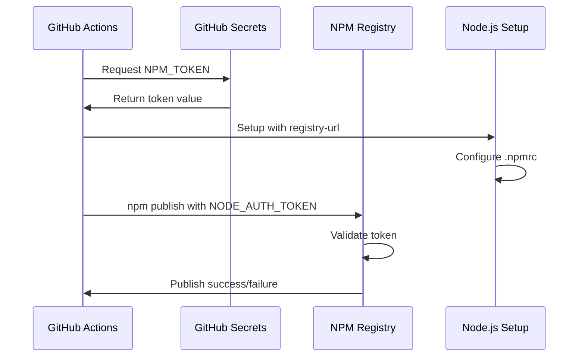
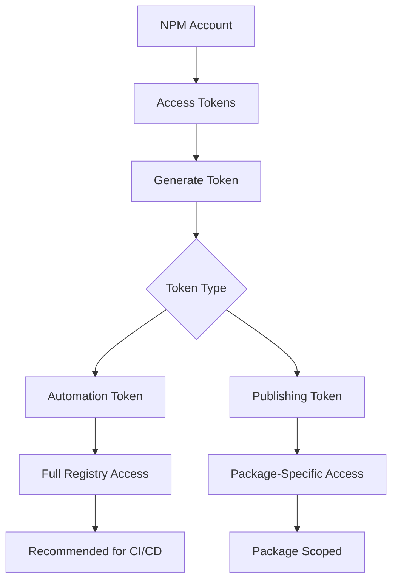

# NPM Token Configuration for GitHub Actions Publishing

## Overview

This design addresses the NPM authentication error encountered in the GitHub Actions release workflow. The job logs show a failure during the NPM publishing step with error `ENEEDAUTH`, indicating that the NPM token configuration is not properly set up or accessible during the workflow execution.

## Problem Analysis

### Current Issue

The release workflow fails at the NPM publishing step with the following error:

```
npm error code ENEEDAUTH
npm error need auth This command requires you to be logged in to https://registry.npmjs.org/
npm error need auth You need to authorize this machine using `npm adduser`
```

### Root Cause Analysis

Based on the job logs, the issue stems from:

1. **Environment Variable Configuration**: The `NODE_AUTH_TOKEN` environment variable shows an empty value in the logs
2. **Secret Access**: The NPM_TOKEN secret may not be properly configured or accessible
3. **Workflow Configuration**: The token setup timing and scope may be incorrect

## Authentication Architecture

### Current Workflow Configuration

```yaml
- name: Setup Node.js
  uses: actions/setup-node@v4
  with:
    node-version: "18"
    registry-url: "https://registry.npmjs.org"

- name: Publish to NPM
  if: ${{ github.event.inputs.publish == 'true' }}
  run: |
    echo "🚀 Publishing to NPM..."
    npm publish
  env:
    NODE_AUTH_TOKEN: ${{ secrets.NPM_TOKEN }}
```

### Authentication Flow Design



## Configuration Requirements

### Repository Secret Setup

The NPM_TOKEN secret must be configured with the following specifications:

| Property  | Value                      | Description                          |
| --------- | -------------------------- | ------------------------------------ |
| **Name**  | `NPM_TOKEN`                | Exact name as referenced in workflow |
| **Type**  | Repository Secret          | Accessible to all workflows          |
| **Value** | NPM Access Token           | Automation token from NPM registry   |
| **Scope** | Repository or Organization | Based on access requirements         |

### NPM Token Generation

The NPM token must be created with appropriate permissions:



### Token Requirements

- **Type**: Automation token (recommended for CI/CD)
- **Permissions**: Publish packages
- **Scope**: All packages or specific package scope
- **Expiration**: Set appropriate expiration policy

## Implementation Strategy

### Phase 1: Secret Configuration Validation

1. **Verify NPM Token Generation**

   - Access NPM registry account
   - Generate new automation token if needed
   - Copy token value securely

2. **Configure GitHub Repository Secret**

   - Navigate to repository Settings → Secrets and variables → Actions
   - Create or update NPM_TOKEN secret
   - Verify secret name matches workflow reference

3. **Test Secret Access**
   - Run a simple workflow to echo masked token presence
   - Verify secret is accessible in workflow context

### Phase 2: Workflow Configuration Update

#### Enhanced Node.js Setup

```yaml
- name: Setup Node.js with NPM Registry
  uses: actions/setup-node@v4
  with:
    node-version: "18"
    registry-url: "https://registry.npmjs.org"
    scope: "@your-scope" # If using scoped packages
  env:
    NODE_AUTH_TOKEN: ${{ secrets.NPM_TOKEN }}
```

#### Pre-publish Validation

```yaml
- name: Validate NPM Authentication
  run: |
    echo "🔐 Validating NPM authentication..."
    npm whoami
    echo "✅ NPM authentication successful"
  env:
    NODE_AUTH_TOKEN: ${{ secrets.NPM_TOKEN }}
```

#### Secure Publishing Step

```yaml
- name: Publish to NPM
  if: ${{ github.event.inputs.publish == 'true' }}
  run: |
    echo "🚀 Publishing to NPM..."
    npm publish --access public
    echo "✅ Package published successfully"
  env:
    NODE_AUTH_TOKEN: ${{ secrets.NPM_TOKEN }}
```

### Phase 3: Enhanced Error Handling

#### Authentication Validation

```yaml
- name: Pre-flight Authentication Check
  run: |
    if [ -z "$NODE_AUTH_TOKEN" ]; then
      echo "❌ NPM_TOKEN secret is not set"
      exit 1
    fi

    echo "🔍 Checking NPM authentication..."
    if ! npm whoami > /dev/null 2>&1; then
      echo "❌ NPM authentication failed"
      echo "Please verify NPM_TOKEN secret is valid"
      exit 1
    fi

    echo "✅ NPM authentication verified"
    echo "📝 Authenticated as: $(npm whoami)"
  env:
    NODE_AUTH_TOKEN: ${{ secrets.NPM_TOKEN }}
```

#### Conditional Publishing Logic

```yaml
- name: Conditional NPM Publish
  if: ${{ github.event.inputs.publish == 'true' }}
  run: |
    echo "🚀 Publishing package to NPM registry..."

    # Check if package already exists at this version
    PACKAGE_NAME=$(node -p "require('./package.json').name")
    PACKAGE_VERSION=$(node -p "require('./package.json').version")

    if npm view "${PACKAGE_NAME}@${PACKAGE_VERSION}" > /dev/null 2>&1; then
      echo "⚠️ Version ${PACKAGE_VERSION} already exists"
      echo "Skipping publish to prevent conflicts"
      exit 0
    fi

    # Perform the publish
    npm publish --access public

    # Verify publication
    sleep 5
    if npm view "${PACKAGE_NAME}@${PACKAGE_VERSION}" > /dev/null 2>&1; then
      echo "✅ Package ${PACKAGE_NAME}@${PACKAGE_VERSION} published successfully"
    else
      echo "❌ Publication verification failed"
      exit 1
    fi
  env:
    NODE_AUTH_TOKEN: ${{ secrets.NPM_TOKEN }}
```

## Security Considerations

### Token Management

- **Rotation Policy**: Implement regular token rotation
- **Least Privilege**: Use tokens with minimal required permissions
- **Monitoring**: Set up alerts for token usage and failures

### Workflow Security

```yaml
# Restrict workflow permissions
permissions:
  contents: read
  packages: write

# Environment protection
environment:
  name: production
  url: https://www.npmjs.com/package/fakegen
```

### Secret Protection

- Never log token values
- Use GitHub's automatic secret masking
- Implement proper error handling without exposing secrets

## Validation and Testing

### Pre-deployment Testing

```yaml
- name: Dry Run NPM Publish
  run: |
    echo "🧪 Testing NPM publish (dry run)..."
    npm publish --dry-run
    echo "✅ Dry run completed successfully"
  env:
    NODE_AUTH_TOKEN: ${{ secrets.NPM_TOKEN }}
```

### Post-deployment Verification

```yaml
- name: Verify NPM Package
  if: ${{ github.event.inputs.publish == 'true' }}
  run: |
    echo "🔍 Verifying published package..."
    PACKAGE_NAME=$(node -p "require('./package.json').name")
    PACKAGE_VERSION=$(node -p "require('./package.json').version")

    # Wait for propagation
    sleep 10

    # Verify package exists
    npm view "${PACKAGE_NAME}@${PACKAGE_VERSION}"
    echo "✅ Package verification completed"
```

## Troubleshooting Guide

### Common Authentication Issues

| Error       | Cause                    | Solution                                 |
| ----------- | ------------------------ | ---------------------------------------- |
| `ENEEDAUTH` | Missing or invalid token | Regenerate NPM token and update secret   |
| `E403`      | Insufficient permissions | Use automation token with publish rights |
| `E404`      | Package not found        | Verify package name and scope            |
| `EEXIST`    | Version already exists   | Increment version number                 |

### Debugging Steps

1. **Verify Secret Configuration**

   ```yaml
   - name: Debug Secret Presence
     run: |
       if [ -n "$NODE_AUTH_TOKEN" ]; then
         echo "✅ NPM_TOKEN secret is present"
       else
         echo "❌ NPM_TOKEN secret is missing"
       fi
   ```

2. **Test NPM Registry Connection**

   ```yaml
   - name: Test Registry Connection
     run: |
       echo "🔗 Testing NPM registry connection..."
       npm config get registry
       npm ping
   ```

3. **Validate Package Configuration**
   ```yaml
   - name: Validate Package
     run: |
       echo "📦 Validating package.json..."
       npm run validate 2>/dev/null || echo "No validate script found"
       npm pack --dry-run
   ```

## Monitoring and Alerting

### Workflow Notifications

```yaml
- name: Notify on Failure
  if: failure()
  uses: actions/github-script@v6
  with:
    script: |
      github.rest.issues.createComment({
        issue_number: context.issue.number,
        owner: context.repo.owner,
        repo: context.repo.repo,
        body: '❌ NPM publishing failed. Please check the workflow logs and NPM token configuration.'
      })
```

### Success Confirmation

```yaml
- name: Success Notification
  if: ${{ github.event.inputs.publish == 'true' && success() }}
  run: |
    echo "🎉 Release completed successfully!"
    echo "📦 Package available at: https://www.npmjs.com/package/fakegen"
    echo "📋 Version: $(node -p 'require(\"./package.json\").version')"
```

## Migration Plan

### Immediate Actions

1. Generate new NPM automation token
2. Configure NPM_TOKEN repository secret
3. Update workflow with enhanced authentication validation
4. Test with dry-run publish

### Gradual Improvements

1. Implement comprehensive error handling
2. Add monitoring and alerting
3. Set up token rotation schedule
4. Document troubleshooting procedures

This design ensures robust NPM token authentication, proper error handling, and secure publishing workflows for the FakeGen project.
