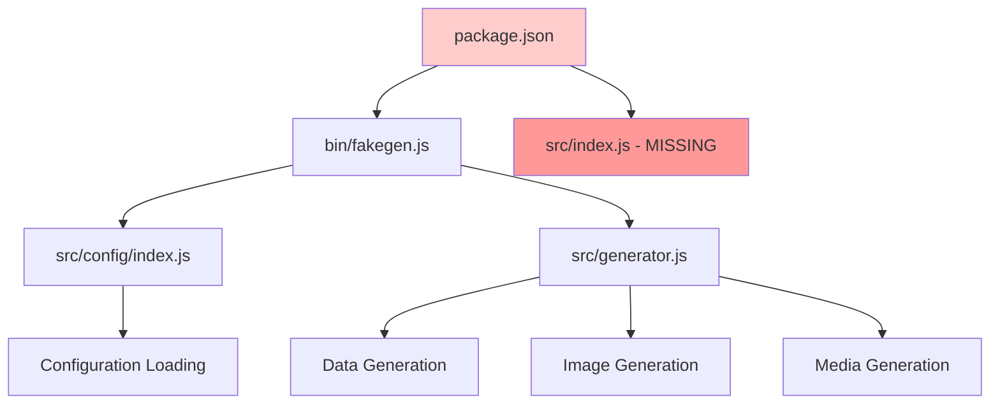

# Package Startup Fix Design

## Overview

This design addresses critical startup issues with the FakeGen CLI tool that prevent `npm start` from executing successfully. The main issues identified include missing entry point files, incorrect package.json configuration, and potential dependency resolution problems.

## Repository Type

**CLI Tool** - A Node.js command-line application with binary executable that generates fake data and media files.

## Architecture

The current architecture has several startup-related issues that need to be resolved:



### Current Issues

1. **Missing Entry Point**: `package.json` specifies `"main": "src/index.js"` but this file doesn't exist
2. **Incorrect Main Field**: The main field should point to the actual entry point or be adjusted for CLI-only usage
3. **Potential Module Export Issues**: Missing index file may cause import/require failures
4. **Configuration Dependencies**: Complex dependency chain may have missing modules

## Core Problems

### 1. Package.json Configuration Issues

**Problem**: The package.json has conflicting configuration:

- `"main": "src/index.js"` - points to non-existent file
- `"bin": {"fakegen": "./bin/fakegen.js"}` - correct CLI entry point
- Missing or incorrect exports configuration

**Impact**:

- npm start fails because main entry point doesn't exist
- Module imports may fail if used as a library
- Package installation and execution errors

### 2. Missing Module Index Files

**Problem**: No central export file for the package as a library

- src/index.js is missing
- No unified API exports for programmatic usage
- Inconsistent module structure

### 3. CLI vs Library Dual Purpose

**Problem**: Package tries to serve both as CLI tool and importable library

- CLI functionality works through bin/fakegen.js
- Library functionality is broken due to missing main entry point
- Unclear package purpose and usage patterns

## Proposed Solutions

### Solution 1: Fix Package.json Main Field

**Option A: CLI-Only Package**

```json
{
  "main": "./bin/fakegen.js",
  "bin": {
    "fakegen": "./bin/fakegen.js"
  }
}
```

**Option B: Create Missing Index File**

```json
{
  "main": "./src/index.js",
  "bin": {
    "fakegen": "./bin/fakegen.js"
  }
}
```

### Solution 2: Create src/index.js Entry Point

Create a proper module entry point that exports the main functionality:

```javascript
// src/index.js
const { generateFakeData } = require("./generator");
const { loadConfig, createDefaultConfig } = require("./config");
const { generateDataForType } = require("./data");
const { generateAbstractImage, generateFavicons } = require("./image");
const { generateProgrammingCodes } = require("./utils/codeGenerator");
const { generateVideos } = require("./utils/videoGenerator");
const { generateAudio } = require("./utils/audioGenerator");

module.exports = {
  // Main generation function
  generateFakeData,

  // Configuration functions
  loadConfig,
  createDefaultConfig,

  // Individual generators
  generateDataForType,
  generateAbstractImage,
  generateFavicons,
  generateProgrammingCodes,
  generateVideos,
  generateAudio,
};
```

### Solution 3: Enhanced Package.json Exports

Provide comprehensive module exports for both CLI and library usage:

```json
{
  "main": "./src/index.js",
  "bin": {
    "fakegen": "./bin/fakegen.js"
  },
  "exports": {
    ".": "./src/index.js",
    "./cli": "./bin/fakegen.js",
    "./config": "./src/config/index.js",
    "./data": "./src/data/index.js",
    "./image": "./src/image/index.js",
    "./utils": "./src/utils/index.js",
    "./generator": "./src/generator.js"
  }
}
```

## Implementation Strategy

### Phase 1: Immediate Startup Fix

1. **Create src/index.js** with basic exports
2. **Update package.json** main field if needed
3. **Verify CLI functionality** with npm start
4. **Test module imports** to ensure no breaking changes

### Phase 2: Comprehensive Module Structure

1. **Enhance src/index.js** with complete API exports
2. **Update package.json exports** for better module resolution
3. **Add TypeScript definitions** if needed for better developer experience
4. **Update documentation** to reflect dual CLI/library usage

### Phase 3: Testing and Validation

1. **Create test scripts** to validate both CLI and library usage
2. **Test npm start command** functionality
3. **Verify module imports** work correctly
4. **Test package installation** in different environments

## File Structure Changes

```
src/
├── index.js (NEW - main entry point)
├── config/
│   └── index.js
├── data/
│   └── index.js
├── image/
│   └── index.js
├── utils/
│   └── index.js
└── generator.js

bin/
└── fakegen.js (existing CLI entry point)

package.json (modified)
```

## Error Handling Strategy

### 1. Graceful Dependency Loading

Implement optional dependency loading for media generation:

```javascript
// Graceful FFmpeg loading
let ffmpeg = null;
try {
  ffmpeg = require("fluent-ffmpeg");
  require("@ffmpeg-installer/ffmpeg");
} catch (error) {
  console.warn("Video generation disabled: FFmpeg dependencies not installed");
}
```

### 2. Configuration Fallbacks

Ensure robust configuration loading with fallbacks:

```javascript
// Enhanced error handling in config loading
async function loadConfig() {
  try {
    // Load configuration with proper error handling
    const config = await loadConfigFile();
    return validateAndMergeConfig(config);
  } catch (error) {
    console.warn(`Configuration error: ${error.message}, using defaults`);
    return getDefaultConfig();
  }
}
```

### 3. Module Import Safety

Implement safe module importing to prevent startup failures:

```javascript
// Safe module loading
function safeRequire(moduleName, fallback = null) {
  try {
    return require(moduleName);
  } catch (error) {
    console.warn(
      `Optional module ${moduleName} not available: ${error.message}`
    );
    return fallback;
  }
}
```

## Testing Strategy

### 1. Startup Validation Tests

```bash
# Test CLI functionality
npm start
npm start -- --help
npm start -- init

# Test as module
node -e "const fg = require('./src/index.js'); console.log(typeof fg.generateFakeData)"
```

### 2. Dependency Resolution Tests

```bash
# Test with minimal dependencies
npm install --production
npm start

# Test with all dependencies
npm install
npm start
```

### 3. Error Condition Tests

```bash
# Test with missing config
rm .fakegen.yml
npm start

# Test with invalid config
echo "invalid: yaml: content" > .fakegen.yml
npm start
```

## Implementation Details

### Required Files to Create

#### 1. src/index.js (Main Entry Point)

```javascript
#!/usr/bin/env node

// Main module exports for library usage
const { generateFakeData } = require("./generator");
const { loadConfig, createDefaultConfig, validateConfig } = require("./config");
const { generateDataForType } = require("./data");
const {
  generateAbstractImage,
  generateCheckerboardImage,
  generateFavicons,
  saveImage,
} = require("./image");
const { generateProgrammingCodes } = require("./utils/codeGenerator");
const { generateVideos } = require("./utils/videoGenerator");
const { generateAudio } = require("./utils/audioGenerator");
const { saveDataToFormats } = require("./utils");

// Export all main functionality
module.exports = {
  // Core generation function
  generateFakeData,

  // Configuration management
  loadConfig,
  createDefaultConfig,
  validateConfig,

  // Data generation
  generateDataForType,
  saveDataToFormats,

  // Image generation
  generateAbstractImage,
  generateCheckerboardImage,
  generateFavicons,
  saveImage,

  // Additional content generators
  generateProgrammingCodes,
  generateVideos,
  generateAudio,
};

// CLI execution (when run directly)
if (require.main === module) {
  console.log(
    "FakeGen: Use bin/fakegen.js for CLI or require this module for library usage"
  );
  console.log('Example: const { generateFakeData } = require("fakegen");');
}
```

#### 2. package.json Updates

Update the package.json to fix the main field and ensure proper module exports:

```json
{
  "main": "src/index.js",
  "bin": {
    "fakegen": "./bin/fakegen.js"
  },
  "scripts": {
    "start": "node bin/fakegen.js",
    "test": "node -e \"const fg = require('./src/index.js'); console.log('Module loads successfully');\""
  }
}
```

### Error Resolution Steps

#### Step 1: Create Missing Entry Point

1. Create src/index.js with proper exports
2. Ensure all required modules are properly imported
3. Add CLI detection for direct execution

#### Step 2: Fix Package Configuration

1. Verify main field points to existing file
2. Maintain bin field for CLI functionality
3. Add test script for validation

#### Step 3: Validate Dependencies

1. Check all require statements resolve correctly
2. Implement graceful handling for optional dependencies
3. Add error handling for missing modules

### Testing Validation

```bash
# Test CLI functionality
npm start
npm start -- --help
npm start -- init

# Test module loading
node -e "const fg = require('./src/index.js'); console.log('Success:', typeof fg.generateFakeData);"

# Test with minimal configuration
echo "data:\n  count: 1\noutput:\n  directory: ./test-output" > .fakegen.yml
npm start
```

## Migration and Deployment

### 1. Backward Compatibility

Ensure changes don't break existing usage:

- CLI commands continue to work
- Existing configuration files remain valid
- No breaking changes to public APIs

### 2. Version Strategy

Implement as patch release since it fixes bugs:

- Version bump to 1.0.1
- Document fixes in release notes
- Maintain semantic versioning

### 3. User Communication

Communicate changes clearly:

- Update README with both CLI and library usage examples
- Document new module import capabilities
- Provide migration guide if needed
